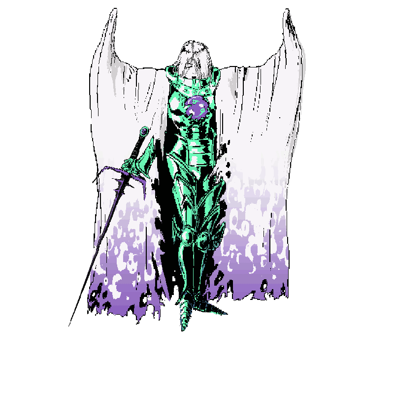
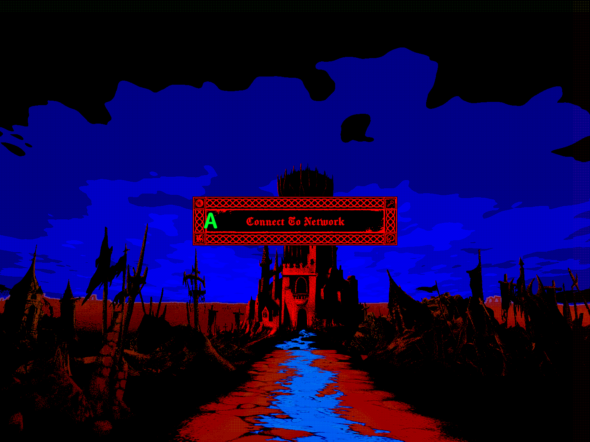
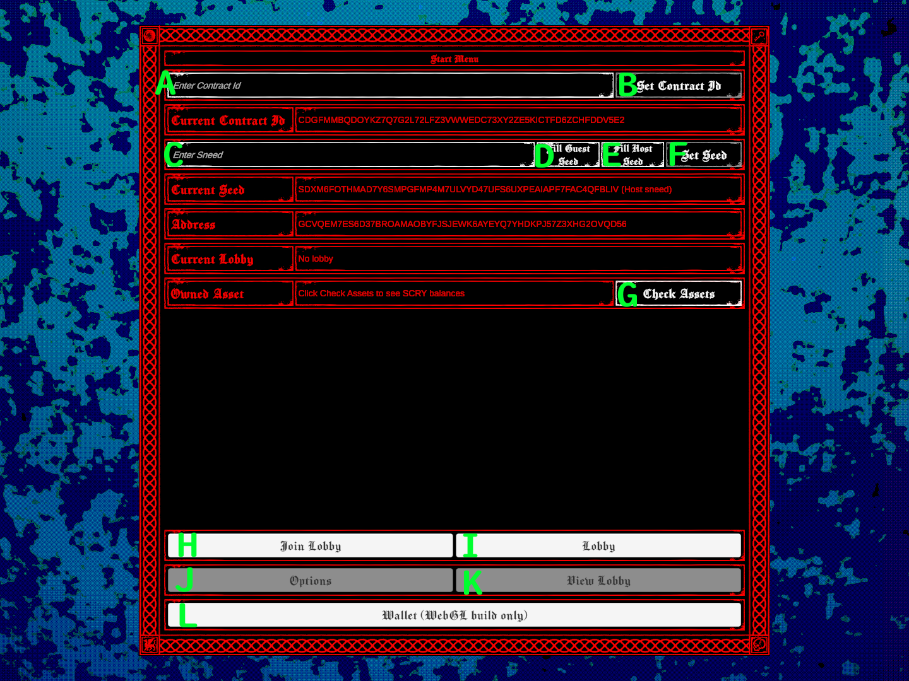
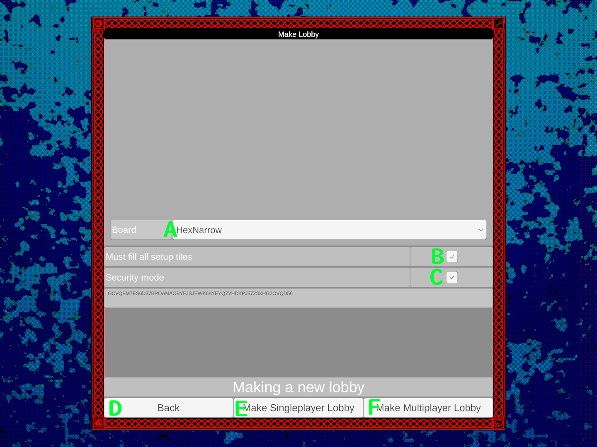
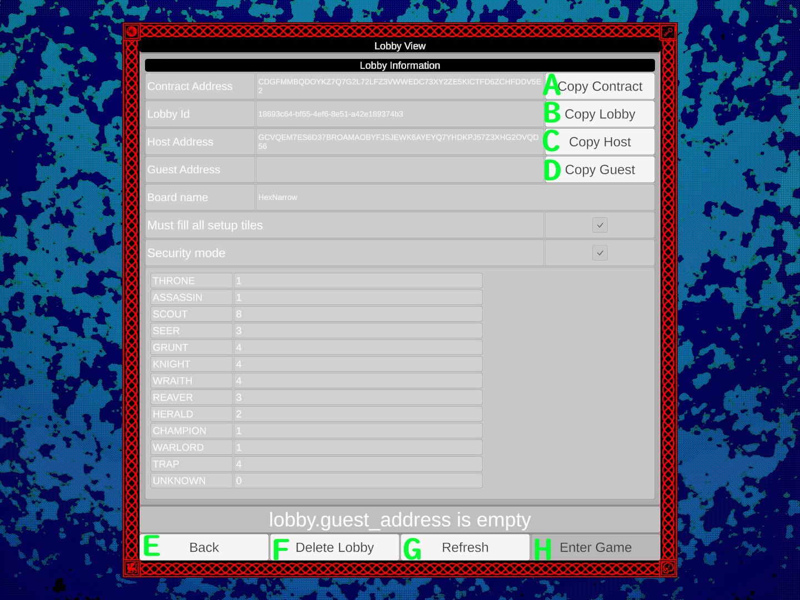
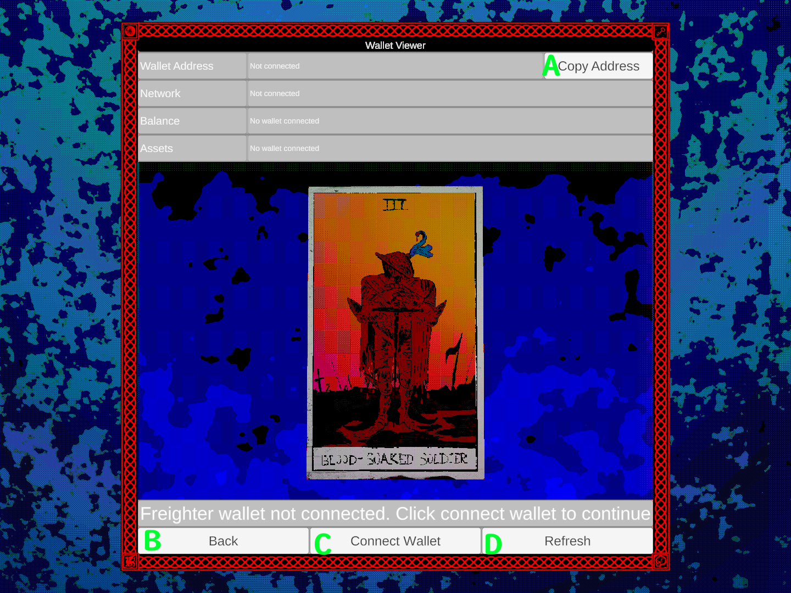
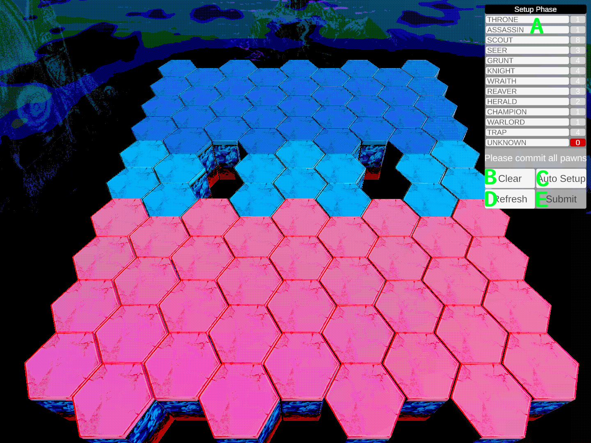
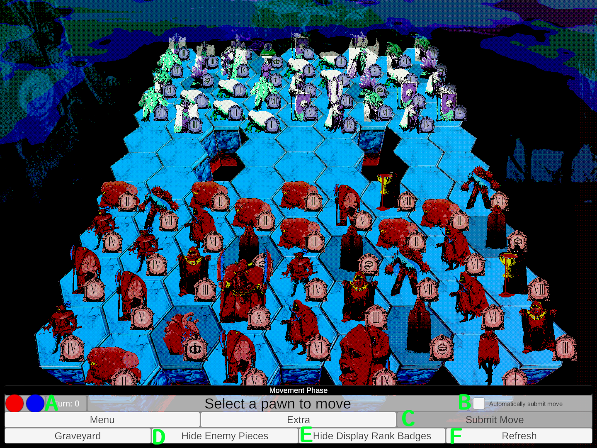

# Warmancer Black Friday Development Log
---
## Entry 2 - July 20 2025


### Deliverables

These were the deliverables promised for the Tranche 2 MVP.
> - **"Multiplayer gameplay modes running on external servers"**
>
>The Testnet build of the game client can be configured to run through any Stellar RPC Testnet endpoint!
>
> - **"Launch a blockchain-enabled testnet version with Anti-cheat smart contracts"**
>
>The Warmancer contract is live on Stellar's Testnet and has been engineered to resist all forms of cheating by using cryptographic verification on all public functions. Despite total transparency, it is **IMPOSSIBLE** to gain an unfair advantage by observing the contract's activity.
>
> - **"Exploration of zero-knowledge proofs (if feasible)"**
>
>We've identified use cases for ZK proofs that could theoretically enhance performance, but Stellar's contract-side ZK-SNARK verification isn’t ready yet. Even if it were, Stellar's transaction fees are already so minimal that the traditional Merkle tree verification we built remains more cost-effective.
>

Tranche 2 deliverables have been ready for a while, but we chose to wait for the Testnet protocol upgrade, allowing us to refine gameplay and graphics. Warmancer has greatly benefited from Protocol 23's improvements, and we're proud to showcase our smart contract to Stellar developers.

## Known Issues

Note: The client provided is a 'testing build' from an earlier point in development history (two weeks ago) from when the contract code was most stable, as opposed to the client. Certain features were stripped for benchmarking and optimization purposes. The graphics and features in this do not reflect the current state of development.

**Stripped features:**
- Singleplayer
- In-game Chat
- Animations
- Boards other than HexNarrow
- Custom boards
- New menu system

<details>
<summary>Click to expand known issues</summary>

>#### Known Contract related issues:
>
>* **Issue: Can prematurely end games with redeem_win call**
>
>	**Cause:** Turn time tracking functionality was disabled because it interfered with simulation.
>	
>	**Current workaround:** None.
>	
>	**Planned solution:** Timeout wins will be reimplemented in the near future
>	
>#### Known Client related issues:
>
>* **Issue: Screen rapidly flashes when waiting for opponents to submit moves**
>
>	**Cause:** That's the debug display, sorry.
>	
>	**Current workaround:** None.
>	
>	**Planned solution:** A build without debug tools will be provided on request.
>	
>* **Issue: Winning and losing games has no feedback**
>
>	**Cause:** Disabled in test build. Victory & defeat screens are still WIP.
>	
>	**Current workaround:** Check the contract state on stellar.expert or debug messages in your browser to see if you won or lost.
>	
>	**Planned solution:** Already implemented in the head build.
>	
>* **Issue: "this client does not have the required cached data to play this lobby" displayed when attempting to enter a lobby**
>
>	**Cause:** The game has been started by another client with your test credentials. Your client doesn't have the required data (the actual ranks of all your hidden pawns) to render the lobby.
>	
>	**Current workaround:** Switch to an entirely new address and start a new game. Only join games that your client has started.
>	
>	**Planned solution:** This is intentional. You can't just change clients and expect the new client to magically know what your pawns are when the server doesn't store that data on purpose. In the future, a client ID scheme will be implemented so this information is presented in a better way.
>	
>#### Known Wallet related issues:
>
>* **Issue: Wallet screen is weird / gives inconsistent information**
>
>	**Cause:** Test branch outdated with recent protocol changes.
>	
>	**Current workaround:** None.
>	
>	**Planned solution:** Will be fixed soon.
>	

</details>

### Fully on Chain Multiplayer

There are very few multiplayer games that run on Layer 1 that can truly be called "fully-on-chain" because players must cover steep transaction fees and developers face strict limitations in unforgiving contract environments. Stellar's cost efficiency and ease of use makes it possible for Warmancer to be entirely on-chain and playable with each turn costing less than a penny.

Warmancer uses every trick in the book and then some more to reduce costs for players:

### Storage Optimization

Stellar storage is by far the largest driver of cost. A turn-based strategy game like Warmancer needs on-chain storage for matchmaking and to maintain a live, mutable game state. A raw snapshot of the game board in XDR weighs in at around 33 KB. A uncompressed XDR snapshot of the state of a Warmancer lobby is approximately 33 KB, far exceeding Stellar's 8 KB return limit. With aggressive optimization, we have reduced our game's storage down to just 1.6 KB, a 96% reduction in storage size.

* **Merkle tree verification: 5.12 KB → 0.01 KB**

Warmancer's design and cryptographic secureness requires a large amount of game state data to be stored on chain. Warmancer's API needs to verify complex client-generated structs, so the full game state must be stored. Hashes in particular are the largest objects in stored game state. A typical Warmancer game must store up to 80 hashes (5120 bytes) of completely uncompressable data. We could truncate the hashes to save space, but this would weaken the cryptographic security of the game and opens the door to pre-imaging attacks. 

Instead, we have use the same solution Stellar uses to verify its own data: Merkle trees. Clients can locally generate a Merkle tree for all their pawn commitments, and the contract only needs to store the root. This is sufficient because the contract only needs to be able to verify a piece of data's "proof of existence at a specific index"

This is the data we will use to prove our comittment:
```
// client stores this to submit later when asked
pub struct HiddenRank {
	pub pawn_id: u32, 
	// Pawn_ids are based on initial position, so they have almost no entropy
	pub rank: u32, 
	// Ranks are between 0 and 12, so no entropy here
	pub salt: u64, 
	// Here's our entropy. This gets hashed too, so in a cryptographic terms, it's actually a "pepper"
}
```
Clients generate 40 hashes of HiddenRank during setup, build a Merkle tree from them, and submit just the root hash.

The request to commit the setup:
```
pub struct CommitSetupReq {
	pub lobby_id: LobbyId,
	// This is the root of the Merkle tree that the client has generated
	pub rank_commitment_root: BytesN<32>, 
}
```
The contract stores the rank_commitment_root as is. Verification happens later, when combat reveals are needed. At that point, the client submits this:
```
pub struct MerkleProof {
	pub leaf_index: u32, 
	// original position of the HiddenRank
	pub siblings: Vec<BytesN<32>>, 
	// A series of hashes tracing from a path from the index to the root
}

pub struct ProveRankReq {
	pub hidden_ranks: Vec<HiddenRank>, 
	// This is a vector because multiple pawns might need to be revealed on the same turn. 
	// The HiddenRanks here are exactly the same as the ones that were used to generate 
	// the hashes in the initial Merkle tree
	pub lobby_id: LobbyId,
	pub merkle_proofs: Vec<MerkleProof>, 
	// This vector maps to the hidden_ranks vector
}
```
With only this unstored ephemeral request data, the contract can reconstruct the hash of the HiddenRank and verify the commitment without storing more than a single 32 byte root per player. Even knowing all intermediate hashes won't help an attacker because they would still need to brute-force a 32 byte pre-image with 64+ bits of entropy.

Here's the merkle proof verification function.
```
pub(crate) fn verify_merkle_proof(e: &Env, leaf: &MerkleHash, proof: &MerkleProof, root: &MerkleHash) -> bool {
	let mut current_hash = leaf.clone();
	let mut index = proof.leaf_index;
	for (_, sibling) in proof.siblings.iter().enumerate() {
		// Create a 32-byte array directly for concatenation
		let mut combined_bytes = [0u8; 32];
		// Determine order based on index (even = current is left, odd = current is right)
		if index % 2 == 0 {
			// Current hash goes on the left, sibling on the right
			combined_bytes[0..16].copy_from_slice(&current_hash.to_array());
			combined_bytes[16..32].copy_from_slice(&sibling.to_array());
		} else {
			// Sibling goes on the left, current hash on the right
			combined_bytes[0..16].copy_from_slice(&sibling.to_array());
			combined_bytes[16..32].copy_from_slice(&current_hash.to_array());
		}
		// Hash the combined bytes
		let parent_full = e.crypto().sha256(&Bytes::from_array(e, &combined_bytes));
		// Take first 16 bytes as the new current hash
		let parent_bytes = parent_full.to_array();
		current_hash = MerkleHash::from_array(e, &parent_bytes[0..16].try_into().unwrap());
		// Move up the tree
		index = index / 2;
	}
	let result = current_hash == *root;
	result
}
```
This technique alone cuts our commitment storage requirement by over 95%, saving about 5 KB per game.

* **Bit packing and data optimization: 15.4 KB → 0.9 KB**

Pawns have a lot of stateful data, so it all needs to be stored.
```
pub struct PawnState {
	pub pawn_id: PawnId,	// never mutates
	pub setup_pos: Pos,		// never mutates
	pub team: bool,			// never mutates, either host or guest
	pub alive: bool,		// mutated when a pawn dies
	pub moved: bool,		// mutated when a pawn moves
	pub moved_scout: bool,	// mutated when a pawn moves more than one tile
	pub pos: Pos,			// mutated when a pawn moves
	pub rank: Vec<Rank>,	// single entry Vec used as an optional. Empty when Rank has not been revealed
}
```
That's over 95 bytes per pawn if you include serialized field names, or 7.6 KB for 80 pawns. This is way too big. By bit-packing all of this into a single u32, we can reduce it to just 3 bytes per pawn.

First, we encode the immutable fields into a single 9-bit pawn_id.
```
pub(crate) fn encode_pawn_id(setup_pos: Pos, user_index: u32) -> u32 {
	let mut id: u32 = 0;
	id |= user_index & 1;                   	// Bit 0: user_index (0=host, 1=guest)
	id |= ((setup_pos.x as u32) & 0xF) << 1;	// Bits 1-4: x coordinate (4 bits, range 0-15)
	id |= ((setup_pos.y as u32) & 0xF) << 5;	// Bits 5-8: y coordinate (4 bits, range 0-15)
	id
}
```
Then we can pack the rest with bitwise ops to trim the fat
```
pub(crate) fn pack_pawn(pawn: PawnState) -> u32 {
	let mut packed: u32 = 0;						// Pack pawn_id (9 bits at head)
	let pawn_id_packed = pawn.pawn_id & 0x1FF;		// 9 bits: 0x1FF = 511
	packed |= pawn_id_packed << 0;					// Pack boolean flags (bits 9-11)
	if pawn.alive { packed |= 1 << 9; }
	if pawn.moved { packed |= 1 << 10; }
	if pawn.moved_scout { packed |= 1 << 11; }		// Pack coordinates (4 bits each, range 0-15)
	packed |= (pawn.pos.x as u32 & 0xF) << 12;
	packed |= (pawn.pos.y as u32 & 0xF) << 16;
	let rank = if pawn.rank.is_empty() { 12 } else { pawn.rank.get(0).unwrap() }; // this is safe, as rank Vec is guaranteed to have exactly one element if not empty
	packed |= (rank as u32 & 0xF) << 20;			// Pack rank (4 bits)
	packed
	// Packed pawns are serialized as a u32 for the sake of memory optimization.
}
```
The end result is a reduction from 95 to 3 bytes per pawn. The total size of all 80 pawns on the board drops from 3.2 KB to 0.4 KB. 

We can do the same thing to Tiles too, reducing 100 of these from 7.8 KB to 0.5 KB
```
pub struct Tile {			// packs into a u32
	pub passable: bool,
	pub pos: Pos,
	pub setup: u32,
	pub setup_zone: u32,
}
```
Even more optimization can be done to the game space to save space, but at this point, the game state is so compact that storage rent is no longer our primary fee concern.

* **Efficient Stellar storage management: Priceless**

This one might seem obvious, but it had a huge impact: the biggest cost reduction from Tranche 1 to Tranche 2 came from moving lobby and game state from Persistent to Temporary storage. That change alone cut the cost of starting a game by 97%.

Now, Warmancer lobbies are ephemeral and have a lifespan of 24 hours. Finishing a game writes a short result log to the contract's Persistent storage and updates the win count on the winner's Persistent User profile. The Warmancer client tracks the TTLs of ledger entries and lets players extend their lobbies if needed.

### Memory and Instruction optimization

We’ve heavily optimized Warmancer’s contract to reduce memory usage and instruction counts. These don’t impact fees as much as storage rent, but they still matter. Here's some miscellaneous things we've done to save on fees. Most of these are just standard Rust best practices:

* Efficient ledger entry access
Entries are read once at the start of a function and written once at the end. No unnecessary reads or writes.
* Avoiding allocation
Avoid unnecessary allocation and cloning with fixed length arrays to optimize memory.
* Read-only simulation functions
We can offer clients opportunities to optimize the number of transactions they make by offering exposed read-only functions for clients to simulate for free. Read only functions are also used to reduce code duplication between contract and client for particularly fragile logic that could change depending on the language, version or environment used.
* Fixed size on stored structs
Stored structs never change size when mutated. This prevents simulation mismatches where a branch of execution might require more resources than estimated. To support this, we avoid using Option<> in any stored struct. Warmancer doesn't store move history or deltas to keep simulations predictable. We're exploring a way for players to submit a verified full replay at the end of a game to log into persistent storage.
* Panic over Error
	Clients who don't simulate before submitting get no mercy. Malformed data should just a panic in production code.
	
### Transaction Count Optimization

One of the hardest problems in Warmancer was building a simultaneous, imperfect-information game on a fully transparent blockchain. Not only is the entire gamestate public, but so are all transactions. That means a player could easily check their opponent’s moves or pawn ranks just by looking up their address on a block explorer.

To prevent this, turns in Warmancer follow a three-stage commit reveal pattern. 

- commit_move: Each player submits a hash of the move they plan to make. The contract stores it, but doesn’t know what it is yet.

- prove_move: After both players have committed, they reveal their original moves. The contract checks the hash and updates the game state, but only if no pawn information needs to be revealed.

- prove_rank: If any unrevealed pawns are involved in combat, players must now submit proofs to reveal their ranks so the contract can resolve the turn correctly.

This pattern ensures secrecy but requires each player to make 3 sequential transactions in the worst case scenario. It takes Stellar 5 seconds to process a ledger, so the minimum wait time is an agonizingly slow 15 seconds between turns.

To solve this, we introduced a 'staggered' commit reveal pattern uses Stellar's transaction simulation feature to reduce cost and latency.

Here’s how it works now:

- Player A checks the current turn state. If they’re the first to act, they submit commit_move.

- Player B checks the ledger and sees that Player A already committed, so they skip straight to commit_move_and_prove_move, a batched call that does both steps in one transaction.

- Now that the contract has commitments for both moves and proof for Player B's move, Player A simulates simulate_collisions, a read-only call that tells them whether any pawn ranks need to be revealed depending on what move was passed in. If no ranks need to be revealed, Player A calls prove_move, and the turn is resolved. If ranks must be revealed, Player A calls prove_move_and_prove_rank—again, batched into one transaction.

- If any of Player B’s pawns also need to be revealed, they finish the turn with a prove_rank call.

By peeking into the contract’s state and choosing the optimal action based on simulation results, players can skip unnecessary steps and bundle operations together. This reduces total transactions per turn from:

- Worst case: 6 → 4

- Best case: 4 → 3

- Wait time: 15s → 10s

- Fee range: $0.028 → $0.019


	
	
	
### Estimated cost breakdown on protocol 23

| Function                    | Ledger Write | Instructions  | Memory Usage  | Non-refundable Fee | Rent Fee     | Total Cost |
|----------------------------|--------------|----------------|----------------|---------------------|--------------|------------|
| **Contract deployment**     | 32,288B      | 27,078,549     | 4,425,065B     | 760,945             | 357,346,831  | $17.33     |
| **make_lobby**              | 1,880B       | 10,016,933     | 2,131,109B     | 158,847             | 375,494      | $0.02      |
| **join_lobby**              | 1,632B       | 2,671,317      | 1,974,405B     | 96,134              | 361,581      | $0.02      |
| **commit_setup**            | 1,432B       | 1,904,447      | 1,895,564B     | 79,680              | 0            | $0.004     |
| **commit_move**             | 1,432B       | 1,934,045      | 1,907,700B     | 79,475              | 0            | $0.004     |
| **commit_move_and_prove_move** | 1,636B   | 4,777,894      | 2,184,741B     | 90,995              | 1,417        | $0.004     |
| **prove_move**              | 1,432B       | 9,681,279      | 2,491,505B     | 106,663             | 0            | $0.005     |
| **prove_move_and_prove_rank** | 1,848B     | 8,944,382      | 2,529,263B     | 122,023             | 1,403        | $0.006     |
| **prove_rank**              | 1,848B       | 3,780,417      | 2,223,335B     | 99,491              | 0            | $0.005     |


Absolute maximum cost for two players to start and play a game of 200 turns (not possible under gameplay rules): **$4.84**

Realistic maximum cost for two players to start and play a game of 200 turns: **$3.48**


---

## Entry 1 - April 28 2025

<div style="display: flex; justify-content: flex-start;">
  
</div>

### Deliverables

These were the deliverables promised for the Tranche 1 MVP. 

> - **"Hand-drawn media and high-quality music assets"**
>
>The MVP build of the game now contains over 200 hand drawn animation frames drawn by Nev, Fei and Robek and 3 epic music tracks by Noxis.
>
>- **"Single-player gameplay modes running on external servers"**
>
>A fully functional single player AI has been added to the game. It runs locally, to allow players to play without being connected to the network.
>
>- **"Basic in-game communication features"**
>
>The game now has a on-chain chat feature so you can taunt your opponents in real-time
>
>- **"Full integration of Stellar wallet support**
>
>The WebGL build of the game can connect and make use of Freighter browser wallets to check assets and send transactions (Wallet signing is currently disabled in the MVP for safety reasons)
>
>- **"Soroban asset support"**
>
>A token has been established on the testnet (SCRY-GAAPZLAZJ5SL4IL63WHFWRUWPK2UV4SREUOWM2DZTTQR7FJPFQAHDSNG)
>
>- **"In-game asset verification system"**
>
>The SCRY token balance is displayed on screen after connecting a wallet to demonstrate asset integration in-game. 

Thanks to hard work from our team through Q1 2025, we were able to complete every deliverable and make significant progress into tranche 2 deliverables, the most significant of which is a fully-on-chain multiplayer running on testnet.

### "So what can I do?"

- You can play the game in singleplayer mode against an AI

- You can open a multiplayer lobby and play against another user on-chain with a testnet account using the Warmancer contract.

- You can connect your Freighter wallet to see your SCRY asset balance
- You can send messages to your opponent with the chatbox

<div style="display: flex; justify-content: flex-start;">
  
</div>

### What's next?

Tranche 2 will be focused on refining the contract to reduce usage cost as much as possible and integrating an indexer to make gameplay truly real-time.
#### Server side:

Warmancer multiplayer is currently entirely on-chain. The state of the match is tracked by the contract and is queried by the client as authoritative. Significant improvements to contract storage efficiency can be made by bitpacking stored data. The large Lobby struct which holds the game state can also be split into smaller ledgers for read efficiency, and much of the state can be held as hashes. We should be able to reduce transaction costs by more than 90% by making these changes. Once the contract has been refined, we can begin work on a webserver that can take in RPC calls from the client and emulate contract functions to allow users to play the game off-chain.

For assets on the Stellar network, our immediate goals are to make assets that people will want. We plan on making high-quality art that can be inspected in and out of the game using SEP-0039. Having these assets in your account will impact the gameplay in some way (Currently still being planned).

#### Client side:

Using an indexer to read contract state will speed up the pace of game and reduce our reliance on the testnet RPC server.

Warmancer's client already looks pretty good, but there's a lot more we can do to make the game exciting. Our artists will be focusing on UI, sound, presentation and animations to bring this game to life. In this phase of development, we will be playtesting a lot to get a feel for how to make the game fun.

The current chat system will be reworked into a more detailed game logging and real-time update subsystem. Players will be able to send taunts to their opponents and some game state will be transmitted through off-chain real-time networks.

Wallets will be more closely integrated into the game as core features reach a point where mainnet operation becomes viable. Once off-chain game management is achieved, transactions can be reduced to submitting cryptographic proofs of game completion rather than entire game states.

### User Guide

This is a guide for the current controls in Warmancer. The UI is still a work in progress, and any unlabeled buttons don't do anything.

#### Intro Screen

<div style="display: flex; justify-content: flex-start;">
  
</div>

First menu that shows up in game.

- **A:** Starts the game. Automatically connects using the development testnet account.

#### Start Menu

<div style="display: flex; justify-content: flex-start;">
  
</div>

Temporary menu for all important top level functions.

- **A:** Text field for inputting a contract ID (must be a valid testnet contract).

- **B:** Sets the game contract to the input of A. Development only! 

- **C:** Text field for inputting a testnet user account secret seed. Development only!

- **D:** Set C to the developer's test "guest" account.

- **E:** Set C to the developer's test "host" account which holds some SCRY.

- **F:** Sets the account used by the game to C. All transactions are signed by this account.

- **G:** Checks the ledger for the current SCRY balance of the currently used account.

- **H:** Go to Lobby View Menu. Is disabled if the account is already in a lobby.

- **I:** Go to Lobby Creation Menu. Is disabled if the account is already in a lobby.

- **J:** Go to Options Menu. Currently disabled in this build.

- **K:** Go to View Lobby Menu. Is disabled if account is not already in a lobby.

- **L:** Go To Wallet Menu.

#### Lobby Creation Menu

<div style="display: flex; justify-content: flex-start;">
  
</div>

Menu for setting the parameters for creating a new game lobby.

- **A:** Dropdown to select the board you want to play on.

- **B:** Toggle an optional parameter that requires players to fill all available tiles on the board with pawns during the setup phase.

- **C:** Toggle an optional parameter to play the game on chain with encrypted data. Currently disabled in this build.

- **D:** Go back to the Start Menu.

- **E:** Start a single player game vs AI with these parameters and go to the Game Setup GUI.

- **F:** Start a multiplayer lobby with these parameters and go to the Lobby View Menu.

#### Lobby View Menu

<div style="display: flex; justify-content: flex-start;">
  
</div>

Menu that displays parameters of the game lobby you're in. Doesn't edit anything.

- **A:** Copies the contract address to clipboard. Doesn't work in WebGL.

- **B:** Copies the lobby Id to clipboard. Doesn't work in WebGL.

- **C:** Copies the lobby host's address to clipboard. Doesn't work in WebGL.

- **D:** Copies the lobby guest's address to clipboard. Doesn't work in WebGL.

- **E:** Go back to the Start Menu.

- **F:** Leaves a lobby permanently, forfeiting the game.

- **G:** Refresh the lobby state to check if a user has joined.

- **H:** Enter the game.

#### Join Lobby Menu

<div style="display: flex; justify-content: flex-start;">
  
</div>

Menu for joining lobbies.

- **A:** Field for entering the lobby Id you want to join

- **B:** Go back to the Start Menu

- **C:** Join the lobby from A

#### Wallet Menu

<div style="display: flex; justify-content: flex-start;">
  
</div>

Menu for wallet related functions. Currently, wallet data does not persist past this menu for safety reasons.

- **A:** Copy connected Freighter wallet address to clipboard. Doesn't work in WebGL. 

- **B:** Go back to the Start Menu.

- **C:** Attempt to connect to Freighter wallet extension.

- **D:** Refresh information about Freighter wallet.

#### Game Setup GUI

<div style="display: flex; justify-content: flex-start;">
  
</div>

GUI for the first phase of the game. You must occupy all tiles of your color with pawns before starting the game and then submit your setup to the network. To set a Pawn on a tile, click a entry from the list and then click a tile. The number to the right of the pawn name is the number of remaining pawns of that type available to you. Clicking a occupied tile removes the pawn. When all pawns have been placed, you can submit your setup.

- **A:** Click a list entry to select the type of pawn you want to place.

- **B:** Clear board of all Pawns.

- **C:** Automatically fill setup tiles with Pawns using AI logic.

- **D:** Refresh the network state of the game. Clears any pawns that have been placed.

- **E:** Submits Pawn commitments and enters Game Play GUI

#### Game Play GUI

GUI for the main phase of the game. To queue a move, click a pawn from your team and click a highlighted pawn. You can change your queued move by selecting a different pawn. You can clear your queued move by clicking an empty or invalid tile. When your move is queued (a red tile and green tile on screen), you can click submit to submit the move commit. When the move commit is submitted, you will be in a state where you can only wait for your opponent to send a move commit. Click refresh to check if your opponent has sent a move commit. Once your opponent has commited a move, your client will automatically calculate the result of the moves. Once this is done, if your opponent hasn't done so either you'll have to wait for them to send the result to the server. When both players have sent results, the network will start the next turn, and the results of the turn will play back for you. In essence, this is a two stage commit-reveal scheme.

<div style="display: flex; justify-content: flex-start;">
  
</div>

- **A:** Displays the current status of the turn. When a circle is filled in, it means that a player has submitted a move for that turn.

- **B:** Toggle to automatically submit moves immediately after selecting a position.

- **C:** Submits move to network after selecting a valid move.

- **D:** Debug toggle to hide or reveal enemy pieces.

- **E:** Toggle to show or display badges next to pawn sprites.

- **F:** Refresh the network state of the game. Required after submitting a move.

### Known Issues

<details>
<summary>These are the current known issues with the MVP build. <b>!!!These issues do not effect core functionality of Tranche 1 deliverables!!!</b></summary>

>### Known Wallet related issues:
>
>* **Issue: The game doesn't respond when Freighter tries to connect but the user isn't logged in.**
>
>	**Cause:** Caused by known bug in Freighter returning null on connection requests from the login screen.
>	
>	**Current workaround:** Click the in-game refresh button again.
>	
>	**Planned solution:** The Freighter team is currently tracking this issue and will fix it.
>	
>* **Issue: You can't connect to the Freighter browser extension from the itch.io page.**
>
>	**Cause:** Caused by the Freighter browser extension rejecting connections from Iframes due to a setting in the manifest.
>	
>	**Current workaround:** The game has to be distributed with a link to the actual location and not through the itch.io page.
>	
>	**Planned solution:** I proposed a change to the Freighter team to either allow Iframe access or add an exception for Itch.io as this behavior limits almost every webgl application. It's currently in triage. If this is not possible, we can just host the game on our website.
>
>### Known Contract related issues:
>
>* **Issue: Transactions sometimes fail because Execution error scecExceededLimit ["operation byte-read resources exceeds amount specified","45856","45260"]**
>
>	**Cause:** Happens when users send move requests too close together, causing simulation state to not match actual state.
>	
>	**Current workaround:** Sending the request again should work.
>	
>	**Planned solution:** The client will check the hashes of the simulated and actual contract states before submitting. This sounds like a race condition thing, but it's actually a transaction precondition issue that should be pretty simple to solve.
>	
>* **Issue: Transactions will fail deep into games because Execution error scecExceededLimit ["ContractData size exceeds network config maximum size","66940","65536"].**
>
>	**Cause:** Happens when the lobby struct gets too big
>	
>	**Current workaround:** Refresh the browser tab and then leave the lobby.
>	
>	**Planned solution:** Will be resolved with a round of storage optimization. Some basic bitpacking should reduce resource usage by up to 90%.
>	
>* **Issue: Transactions are very expensive.**
>
>	**Cause:** Contract is not yet optimized, everything is on persistent storage.
>	
>	**Current workaround:** It's testnet. 
>	
>	**Planned solution:** Storage optimization, Temp storage, Ledger splitting
>	
>### Known Game Issues:
>
>* **Issue: Copy buttons don't work in WebGL.**
>	
>	**Cause:** Access to the system clipboard copy buffer is restricted from within Unity engine.
>	
>	**Current workaround:** Use Javascript interop layer to send data to user's clipboard.
>
>* **Issue: There is no way to exit a game after winning or losing.**
>
>	**Cause:** Ending screens are currently just a placeholder.
>	
>	**Current workaround:** Refresh the browser tab and then leave the lobby.
>	
>	**Planned solution:** Finish assets for ending screen.
>	
>* **Issue: It's too hard to tell what's going on when pawns move around.**
>
>	**Cause:** Resolve phase is not implemented. We had to remove a lot of assets and effects and animations to focus on game stability. Will be reimplemented soon. Pawn actions will be processed in sequential order.
>	
>	**Current workaround:** All pawn actions are logged in console. filter with the keyword "XXX" to see gameplay related logs.
>	
>	**Planned solution:** Battle animations, more effects, in-game game logging.
>
>* **Issue: Having to click refresh  a lot in multiplayer is inconvinient**
>
>	**Cause:** We don't have a real-time indexer at the moment so we have to request data from RPC to pull events.
>	
>	**Current workaround:** Manual refreshing.
>	
>	**Planned solution:** Pinging RPC frequently is easy but it's impolite and it won't scale well. Currently investigating indexer services for Stellar or hosting our own.
>	
>* **Issue: Can't quit from within game**
>
>	**Cause:** Exit menu is still being designed.
>	
>	**Current workaround:** Refresh the browser tab.
>	
>	**Planned solution:** An exit menu will be added soon.
>
</details>

---