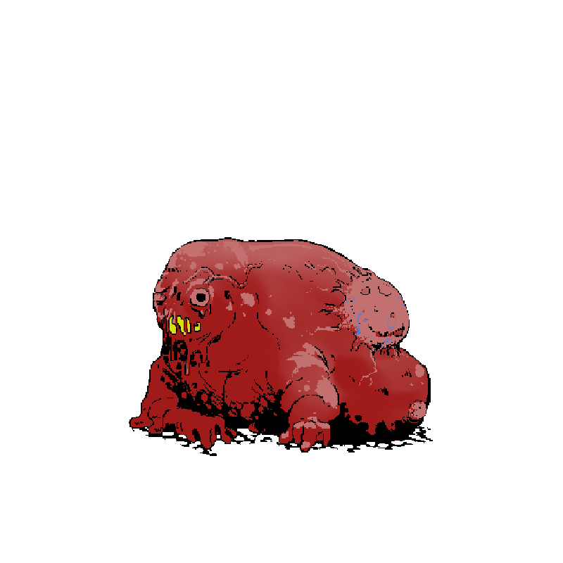

# Warmancer Black Friday Development Log
---
## Entry 1 - April 28 2025

  

### Deliverables

These were the deliverables promised for the Tranche 1 MVP. 

> - **"Hand-drawn media and high-quality music assets"**
>
>The MVP build of the game now contains over 200 hand drawn animation frames drawn by Nev, Fei and Robek and 3 epic music tracks by Noxis.
>
>- **"Single-player gameplay modes running on external servers"**
>
>A fully functional single player AI has been added to the game. It runs locally, to allow players to play without being connected to the network.
>
>- **"Basic in-game communication features"**
>
>The game now has a on-chain chat feature so you can taunt your opponents in real-time
>
>- **"Full integration of Stellar wallet support**
>
>The WebGL build of the game can connect and make use of Freighter browser wallets to check assets and send transactions (Wallet signing is currently disabled in the MVP for safety reasons)
>
>- **"Soroban asset support"**
>
>A token has been established on the testnet (SCRY-GAAPZLAZJ5SL4IL63WHFWRUWPK2UV4SREUOWM2DZTTQR7FJPFQAHDSNG)
>
>- **"In-game asset verification system"**
>
>The SCRY token balance is displayed on screen after connecting a wallet to demonstrate asset integration in-game. 

Thanks to hard work from our team through Q1 2025, we were able to complete every deliverable and make significant progress into tranche 2 deliverables, the most significant of which is a fully-on-chain multiplayer running on testnet.

### "So what can I do?"

- You can play the game in singleplayer mode against an AI

- You can open a multiplayer lobby and play against another user on-chain with a testnet account using the Warmancer contract.

- You can connect your Freighter wallet to see your SCRY asset balance
- You can send messages to your opponent with the chatbox

  

### What's next?

Tranche 2 will be focused on refining the contract to reduce usage cost as much as possible and integrating an indexer to make gameplay truly real-time.
#### Server side:

Warmancer multiplayer is currently entirely on-chain. The state of the match is tracked by the contract and is queried by the client as authoritative. Significant improvements to contract storage efficiency can be made by bitpacking stored data. The large Lobby struct which holds the game state can also be split into smaller ledgers for read efficiency, and much of the state can be held as hashes. We should be able to reduce transaction costs by more than 90% by making these changes. Once the contract has been refined, we can begin work on a webserver that can take in RPC calls from the client and emulate contract functions to allow users to play the game off-chain.

For assets on the Stellar network, our immediate goals are to make assets that people will want. We plan on making high-quality art that can be inspected in and out of the game using SEP-0039. Having these assets in your account will impact the gameplay in some way (Currently still being planned).

#### Client side:

Using an indexer to read contract state will speed up the pace of game and reduce our reliance on the testnet RPC server.

Warmancer's client already looks pretty good, but there's a lot more we can do to make the game exciting. Our artists will be focusing on UI, sound, presentation and animations to bring this game to life. In this phase of development, we will be playtesting a lot to get a feel for how to make the game fun.

The current chat system will be reworked into a more detailed game logging and real-time update subsystem. Players will be able to send taunts to their opponents and some game state will be transmitted through off-chain real-time networks.

Wallets will be more closely integrated into the game as core features reach a point where mainnet operation becomes viable. Once off-chain game management is achieved, transactions can be reduced to submitting cryptographic proofs of game completion rather than entire game states.

### User Guide

This is a guide for the current controls in Warmancer. The UI is still a work in progress, and any unlabeled buttons don't do anything.

#### Intro Screen

  

First menu that shows up in game.

- **A:** Starts the game. Automatically connects using the development testnet account.

#### Start Menu

  

Temporary menu for all important top level functions.

- **A:** Text field for inputting a contract ID (must be a valid testnet contract).

- **B:** Sets the game contract to the input of A. Development only! 

- **C:** Text field for inputting a testnet user account secret seed. Development only!

- **D:** Set C to the developer's test "guest" account.

- **E:** Set C to the developer's test "host" account which holds some SCRY.

- **F:** Sets the account used by the game to C. All transactions are signed by this account.

- **G:** Checks the ledger for the current SCRY balance of the currently used account.

- **H:** Go to Lobby View Menu. Is disabled if the account is already in a lobby.

- **I:** Go to Lobby Creation Menu. Is disabled if the account is already in a lobby.

- **J:** Go to Options Menu. Currently disabled in this build.

- **K:** Go to View Lobby Menu. Is disabled if account is not already in a lobby.

- **L:** Go To Wallet Menu.

#### Lobby Creation Menu

  

Menu for setting the parameters for creating a new game lobby.

- **A:** Dropdown to select the board you want to play on.

- **B:** Toggle an optional parameter that requires players to fill all available tiles on the board with pawns during the setup phase.

- **C:** Toggle an optional parameter to play the game on chain with encrypted data. Currently disabled in this build.

- **D:** Go back to the Start Menu.

- **E:** Start a single player game vs AI with these parameters and go to the Game Setup GUI.

- **F:** Start a multiplayer lobby with these parameters and go to the Lobby View Menu.

#### Lobby View Menu

  

Menu that displays parameters of the game lobby you're in. Doesn't edit anything.

- **A:** Copies the contract address to clipboard. Doesn't work in WebGL.

- **B:** Copies the lobby Id to clipboard. Doesn't work in WebGL.

- **C:** Copies the lobby host's address to clipboard. Doesn't work in WebGL.

- **D:** Copies the lobby guest's address to clipboard. Doesn't work in WebGL.

- **E:** Go back to the Start Menu.

- **F:** Leaves a lobby permanently, forfeiting the game.

- **G:** Refresh the lobby state to check if a user has joined.

- **H:** Enter the game.

#### Join Lobby Menu

  

Menu for joining lobbies.

- **A:** Field for entering the lobby Id you want to join

- **B:** Go back to the Start Menu

- **C:** Join the lobby from A

#### Wallet Menu

  

Menu for wallet related functions. Currently, wallet data does not persist past this menu for safety reasons.

- **A:** Copy connected Freighter wallet address to clipboard. Doesn't work in WebGL. 

- **B:** Go back to the Start Menu.

- **C:** Attempt to connect to Freighter wallet extension.

- **D:** Refresh information about Freighter wallet.

#### Game Setup GUI

  

GUI for the first phase of the game. You must occupy all tiles of your color with pawns before starting the game and then submit your setup to the network. To set a Pawn on a tile, click a entry from the list and then click a tile. The number to the right of the pawn name is the number of remaining pawns of that type available to you. Clicking a occupied tile removes the pawn. When all pawns have been placed, you can submit your setup.

- **A:** Click a list entry to select the type of pawn you want to place.

- **B:** Clear board of all Pawns.

- **C:** Automatically fill setup tiles with Pawns using AI logic.

- **D:** Refresh the network state of the game. Clears any pawns that have been placed.

- **E:** Submits Pawn commitments and enters Game Play GUI

#### Game Play GUI

GUI for the main phase of the game. To queue a move, click a pawn from your team and click a highlighted pawn. You can change your queued move by selecting a different pawn. You can clear your queued move by clicking an empty or invalid tile. When your move is queued (a red tile and green tile on screen), you can click submit to submit the move commit. When the move commit is submitted, you will be in a state where you can only wait for your opponent to send a move commit. Click refresh to check if your opponent has sent a move commit. Once your opponent has commited a move, your client will automatically calculate the result of the moves. Once this is done, if your opponent hasn't done so either you'll have to wait for them to send the result to the server. When both players have sent results, the network will start the next turn, and the results of the turn will play back for you. In essence, this is a two stage commit-reveal scheme.

  

- **A:** Displays the current status of the turn. When a circle is filled in, it means that a player has submitted a move for that turn.

- **B:** Toggle to automatically submit moves immediately after selecting a position.

- **C:** Submits move to network after selecting a valid move.

- **D:** Debug toggle to hide or reveal enemy pieces.

- **E:** Toggle to show or display badges next to pawn sprites.

- **F:** Refresh the network state of the game. Required after submitting a move.

### Known Issues

These are the current known issues with the MVP build. <b>!!!These issues do not effect core functionality of Tranche 1 deliverables!!!</b>

>### Known Wallet related issues:
>
>* **Issue: The game doesn't respond when Freighter tries to connect but the user isn't logged in.**
>
>	**Cause:** Caused by known bug in Freighter returning null on connection requests from the login screen.
>	
>	**Current workaround:** Click the in-game refresh button again.
>	
>	**Planned solution:** The Freighter team is currently tracking this issue and will fix it.
>	
>* **Issue: You can't connect to the Freighter browser extension from the itch.io page.**
>
>	**Cause:** Caused by the Freighter browser extension rejecting connections from Iframes due to a setting in the manifest.
>	
>	**Current workaround:** The game has to be distributed with a link to the actual location and not through the itch.io page.
>	
>	**Planned solution:** I proposed a change to the Freighter team to either allow Iframe access or add an exception for Itch.io as this behavior limits almost every webgl application. It's currently in triage. If this is not possible, we can just host the game on our website.
>
>### Known Contract related issues:
>
>* **Issue: Transactions sometimes fail because Execution error scecExceededLimit ["operation byte-read resources exceeds amount specified","45856","45260"]**
>
>	**Cause:** Happens when users send move requests too close together, causing simulation state to not match actual state.
>	
>	**Current workaround:** Sending the request again should work.
>	
>	**Planned solution:** The client will check the hashes of the simulated and actual contract states before submitting. This sounds like a race condition thing, but it's actually a transaction precondition issue that should be pretty simple to solve.
>	
>* **Issue: Transactions will fail deep into games because Execution error scecExceededLimit ["ContractData size exceeds network config maximum size","66940","65536"].**
>
>	**Cause:** Happens when the lobby struct gets too big
>	
>	**Current workaround:** Refresh the browser tab and then leave the lobby.
>	
>	**Planned solution:** Will be resolved with a round of storage optimization. Some basic bitpacking should reduce resource usage by up to 90%.
>	
>* **Issue: Transactions are very expensive.**
>
>	**Cause:** Contract is not yet optimized, everything is on persistent storage.
>	
>	**Current workaround:** It's testnet. 
>	
>	**Planned solution:** Storage optimization, Temp storage, Ledger splitting
>	
>### Known Game Issues:
>
>* **Issue: Copy buttons don't work in WebGL.**
>	
>	**Cause:** Access to the system clipboard copy buffer is restricted from within Unity engine.
>	
>	**Current workaround:** Use Javascript interop layer to send data to user's clipboard.
>
>* **Issue: There is no way to exit a game after winning or losing.**
>
>	**Cause:** Ending screens are currently just a placeholder.
>	
>	**Current workaround:** Refresh the browser tab and then leave the lobby.
>	
>	**Planned solution:** Finish assets for ending screen.
>	
>* **Issue: It's too hard to tell what's going on when pawns move around.**
>
>	**Cause:** Resolve phase is not implemented. We had to remove a lot of assets and effects and animations to focus on game stability. Will be reimplemented soon. Pawn actions will be processed in sequential order.
>	
>	**Current workaround:** All pawn actions are logged in console. filter with the keyword "XXX" to see gameplay related logs.
>	
>	**Planned solution:** Battle animations, more effects, in-game game logging.
>
>* **Issue: Having to click refresh  a lot in multiplayer is inconvinient**
>
>	**Cause:** We don't have a real-time indexer at the moment so we have to request data from RPC to pull events.
>	
>	**Current workaround:** Manual refreshing.
>	
>	**Planned solution:** Pinging RPC frequently is easy but it's impolite and it won't scale well. Currently investigating indexer services for Stellar or hosting our own.
>	
>* **Issue: Can't quit from within game**
>
>	**Cause:** Exit menu is still being designed.
>	
>	**Current workaround:** Refresh the browser tab.
>	
>	**Planned solution:** An exit menu will be added soon.
>

---