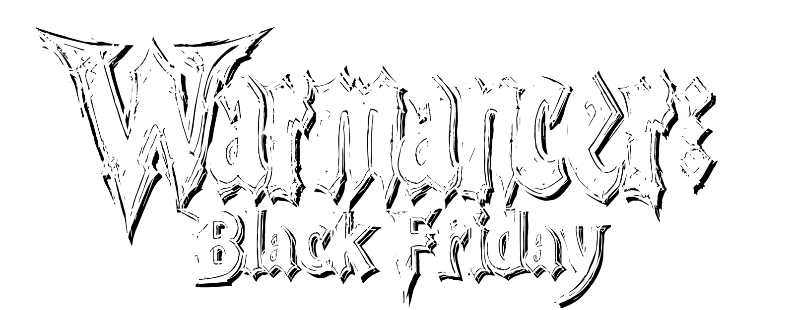
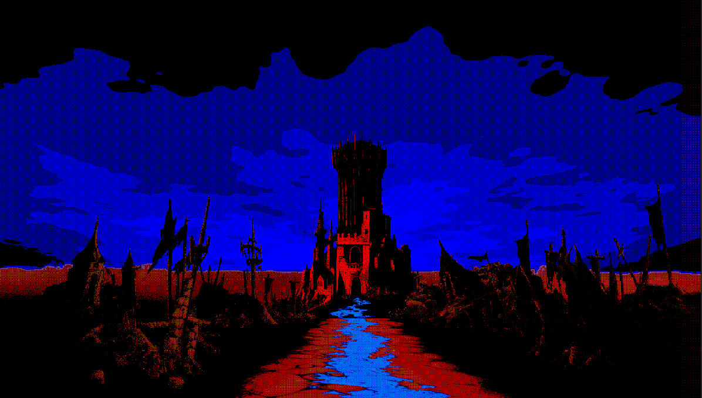
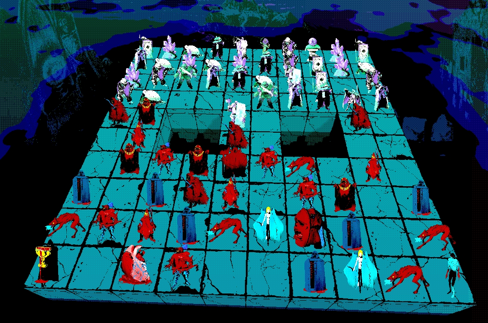
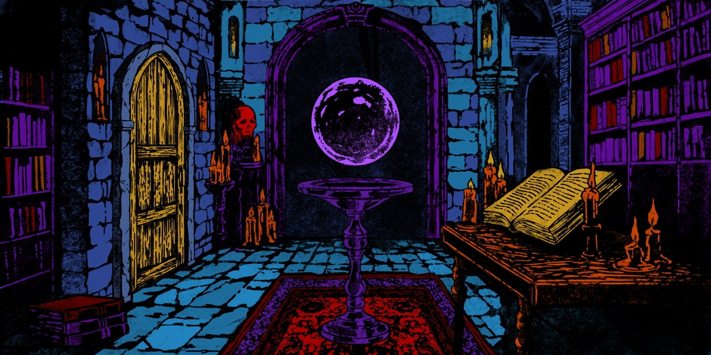

  

# Technical documentation for Warmancer Black Friday, a electronic game developed by Scrying Stone
---
## Warmancer Black Friday
Warmancer Black Friday is a free online strategy game developed by Scrying Stone designed to showcase the potential of the Stellar blockchain in gaming. It’s a 1v1 player-versus-player experience that combines turn-based mechanics with simultaneous turn gameplay, all built around the concept of imperfect information. The game can be played directly on-chain, offering a seamless integration of blockchain technology into the gaming experience.

  

## Features
- **Online and Offline Gameplay**: Challenge other players using matchmaking or wallet addresses, or hone your skills offline against an AI.
- **Multiple Platforms**: Play through your web browser, [Discord Activities](https://discord.com/developers/docs/activities/overview), or use the mobile app.
- **Highly Customizable**: Tailor your experience with custom boards, rules, and pawns to match your preferences.
- **On-Chain Gameplay**: Designed for trustless, serverless, and fully verifiable gameplay using smart contracts.
- **Stellar Blockchain Integration**: Effortlessly connect wallets and challenge others using Soroban smart contracts.
- **NFT Integration**: Seamlessly incorporate NFT assets into the game as usable items, rewards, or tradeable assets.
- **Handcrafted Art and Animations**: Stunning hand drawn visuals created by [Blakkmass](https://x.com/blakkmassart) and [Robek World](https://x.com/robek_world).
- **Original Music**: Immersive soundtrack composed by [Noxis](https://x.com/aegiuscreator).

  

## Build Targets

- **WebGL 2.0**: The primary build target for the Warmancer client is WebGL 2.0, ensuring compatibility with leading web browsers. WebGL was chosen for its accessibility, allowing players to dive into the game instantly without downloads or installations, significantly reducing user friction.
- **PC**: Warmancer Black Friday is also available as a standalone executable distributed through marketplaces like Steam, Epic Games Store and Itch.io, offering a dedicated experience for players who prefer desktop gaming.
- **Mobile**: An optimized mobile version of Warmancer is designed to run seamlessly on mobile browsers or as a standalone app available through app stores, ensuring smooth performance on smaller devices.
- **Discord Activities**: Warmancer Black Friday integrates with Discord Activities to enable gameplay directly within the Discord application.

  

## Tech Stack
### Client Engine: Unity3D
The Warmancer client is developed on the Unity game engine to leverage its versatile build platform selection and graphical capabilities. Unity engine empowers us to rapidly prototype our game, leverage existing assets and reach the largest audience.
### Server: Cloud based custom .NET solution
While Warmancer doesn't require a traditional server when played on-chain, A cloud based server will be built to allow users without crypto wallets to authenticate, find matches and play with others.
### Blockchain Integration: Stellar .NET SDK
Warmancer is made possible by the Stellar .NET SDK, which allows .NET applications like Unity3D programs to interface with the Stellar ecosystem using Horizon.

### Distribution
Warmancer Black Friday is currently hosted on itch.io, a popular indie game distribution site with free WebGL game hosting. Warmancer can be ported to any marketplace or distribution platform where PC games are sold, as well as app stores for mobile users. 

  

## Credits

Robek, Dune, Nev, Rylen, Noxis, and Mono

