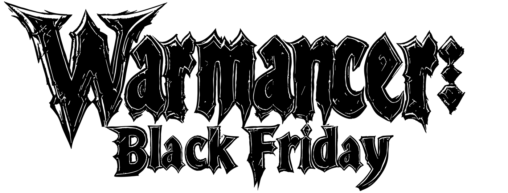

# Technical documentation for Warmancer Black Friday, a electronic game by Scrying Stone

## Warmancer Black Friday
Warmancer Black Friday is a free online strategy game developed by Scrying Stone designed to showcase the potential of the Stellar blockchain in gaming. It’s a 1v1 player-versus-player experience that combines turn-based mechanics with simultaneous turn gameplay, all built around the concept of imperfect information. The game can be played directly on-chain, offering a seamless integration of blockchain technology into the gaming experience.

## Features
- **Online and Offline Gameplay**: Challenge other players using matchmaking or wallet addresses, or hone your skills offline against an AI.
- **Multiple Platforms**: Play through your web browser, [Discord Activities](https://discord.com/developers/docs/activities/overview), or use the mobile app.
- **Highly Customizable**: Tailor your experience with custom boards, rules, and pawns to match your preferences.
- **On-Chain Gameplay**: Designed for trustless, serverless, and fully verifiable gameplay with accurate record-keeping.
- **NFT Integration**: Seamlessly incorporate NFT assets into the game as usable items, rewards, or tradeable assets.
- **Stellar Wallet Integration**: Effortlessly connect wallets using the Stellar .NET SDK ([GitHub Repository](https://github.com/Kirbyrawr/stellar-sdk-unity)).
- **Handcrafted Art and Animations**: Stunning hand drawn visuals created by [Blakkmass](https://x.com/blakkmassart) and [Robek World](https://x.com/robek_world).
- **Original Music**: Immersive soundtrack composed by [Noxis](https://x.com/aegiuscreator).

## Build Targets

- **WebGL 2.0**: The primary build target for the Warmancer client is WebGL 2.0, ensuring compatibility with leading web browsers. WebGL was chosen for its accessibility, allowing players to dive into the game instantly without downloads or installations, significantly reducing user friction.
- **PC**: Warmancer is also available as a standalone executable distributed through marketplaces like Steam, Epic Games Store and Itch.io, offering a dedicated experience for players who prefer desktop gaming.
- **Mobile**: An optimized mobile version of Warmancer is designed to run seamlessly on mobile browsers or as a standalone app available through app stores, ensuring smooth performance on smaller devices.
- **Discord Activities**: Warmancer Black Friday integrates with Discord Activities to enable gameplay directly within the Discord application.

## Credits

Robek, Dune, Nev, Rylen, Noxis, and Mono

